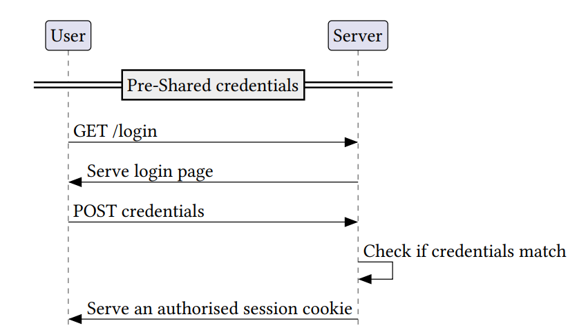

# Example
In this example, we demonstrate how to model and analyse a login protocol. 

To model a protocol, a user needs to specify two main parts: Servers and scripts. To analyse, they will then need to formalise the security property that is to be investigated. Here, we will examine the following simple protocol:



Now, let's see how a user - let's call her Alice - would define the behaviour of this server.

## Pre-shared secrets
As Alice wants to assume pre-shared secrets (in this case, the user has previously registered an account on the server), we need a rule for this:

```
rule preShareLoginDetails:
    [ !ClaimDomain($Domain, 'loginSite')
    , !Browser(~bid, $Browser)
    , Fr(~login) ]
    -->
    [ !LoginDetails($Domain, ~login)
    , !Secrets($Browser, $Domain, $Scheme, ~login)
    , !ServerSecret($Domain, ~login)
    ]
```

Now we can explain the facts:
- `!ClaimDomain($Domain, 'loginSite')` - This fact is provided by our framework. By using this fact, we ensure that our Server will only listen to an address reserved for `loginSite`
- `!Browser(~bid, $Browser)` - This fact is provided by our framework. With this, we take a browser (which subsumes its user) to share credentials with.
- `Fr(~login)` - With this fact, a builtin in Tamarin, we generate new credentials.
- `!LoginDetails($Domain, ~login)` - With this user-defined fact, we remember that `~login` are valid credentials for an account on our domain.
- `!Secrets($Browser, $Domain, $Scheme, ~login)` - This fact is provided by our framework. This stores the credentials in the secret storage of the browser.
- `!ServerSecret($Domain, ~login)` - This fact is provided by our framework. This stores the credentials in the secret storage of the server.

Note that, with the exception of the `!LoginDetails` fact, all facts in the above rule have meaning in our framework or Tamarin. For example, the `!ServerSecret` fact will leak any secrets on compromise of the server - without the user having to worry about modelling this.

## Listening for and Responding to Requests
Next, Alice needs the server to listen for incoming requests, and respond to those requests by serving a login page:

```
rule SiteLoginPage:
    let body = <'LoginToSite', 'bot> in
    [ !ClaimDomain($Domain, 'loginSite')
    , Receive_Request($Browser, $Domain,'https', ~nonce, 'GET', '/login', parameters, cookies, origin, referer, auth, inbody)]
    -->
    [Send_Reply($Domain, $Browser,'https', ~nonce, '200', NoCookies(), NoCookies(), NoLocation(), NoReferrerPolicy(), NoSTS(), body)]
```

- `!ClaimDomain($Domain, 'loginSite')` - As above, the server listens to its address.
- `Receive_Request($Browser, $Domain,'https', ~nonce, 'GET', '/login', parameters, cookies, origin, referer, auth, newbody)` - This fact is provided by our framework. With this fact, Alice can describe what requests the server should listen to: In this case, it will be listening to `GET` requests to the `/login` page, and only via `https`. Everything else in the request (like cookies and other headers) can be arbitrary, as the server does not need any other information.
- `Send_Reply($Domain, $Browser,'https', ~nonce, '200', NoCookies(), NoCookies(), NoLocation(), NoReferrerPolicy(), NoSTS(), body)` - This fact is provided by our framework. With this fact, Alice describes the reply the server will send: It will reply to the same browser that sent the request, matching the nonce from the request. The latter terms are more interesting: Alice can specify the http status code (in thise case, 200), the value of headers like Set-Cookie or STS, as well as the body of the response. The body will be loaded by the browser as a new document, and hence always has to be of the form `<Script, Scriptstate>`. That, of course, also means that Alice will have to define the way the server's loginpage should work, which will be our next step:

## Defining Scripts
```
rule LoginScript:
let docURL = <$Scheme, $DocDomain, path, params, fragment>
    docOrigin = <$DocDomain, $Scheme> in
   [ Document(~did, $Browser, $TLW, docURL, referer, refpolicy, 'LoginToSite', 'bot')
   , !Secrets($Browser, $DocDomain, $Scheme, ~login) ]
   --[PDAddBody(<'Credentials', ~login>)]->
   [ Send_Request_Browser($Browser, $TLW, 'REQ', $Scheme, $DocDomain, '/loginform', NoParams(), 'bot', 'POST', NoAuth(), docOrigin, NoReferrer(), NoReferrerPolicy(), <'Credentials', ~login>)
   ,  Document(~did, $Browser, $TLW, docURL, referer, refpolicy, 'LoginToSite', 'Scriptover') ]
```

Before we explain the facts involved in this rule, we need to note that what a script can do is defined quite rigorously in the WIM. Alice must be careful to adhere to these specifications.
- `Document(~did, $Browser, $TLW, docURL, referer, refpolicy, 'LoginToSite', 'bot')` - This fact is provided by our framework. It signifies that a document is loaded in `$Browser`, under the top-level window `$TLW`, with its location being `docURL`, having been referred to by `referer` and adhering to the referrerpolicy `refpolicy`. Furthermore, the document has loaded the script `'LoginToSite'`, whose state is `'bot'`.
- `!Secrets($Browser, $DocDomain, $Scheme, ~login)` - With this fact, we access the browser's secret storage for the login credentials
- `Send_Request_Browser($Browser, $TLW, 'REQ', $Scheme, $DocDomain, '/loginform', NoParams(), 'bot', 'POST', NoAuth(), docOrigin, NoReferrer(), NoReferrerPolicy(), <'Credentials', ~login>)` - This fact is provided by our framework. With it, Alice specifies what request the browser will send out on script execution. Note that a script not only models the behaviour of the website, but also the actions the user of the browser can take on the website, in this case, that would be filling out a form and submitting their login credentials. Thus, the script will have the browser send a request to the `/loginform` endpoint of the domain that the script has been loaded on, importantly including the users credentials as the body.
- `Document(~did, $Browser, $TLW, docURL, referer, refpolicy, 'LoginToSite', 'Scriptover')` - the script then also updates its state, in this case simply noting that the login has been submitted, and there is nothing further to do.


## Finishing up
Now, Alice needs to work on the server again - it should listen on `/loginform` for (correct) credentials and serve the user an authorised session cookie, if the login was successful.

```
rule SiteLoginForm:
    let body = <'SuccessfulLogin', 'bot'> in
    [ !LoginDetails($Domain, ~login)
    , Receive_Request($Browser, $Domain,'https', ~nonce, 'POST', '/loginform', parameters, cookies, origin, referer, auth, <'Credentials', ~login>)
    , Fr(~token)]
    --[PDAddSec($Domain, $Browser, <'SessionToken',~token>)]->
    [ Send_Reply($Domain, $Browser,'https', ~nonce, '200', NoCookies(), NoCookies() ++ <'SessionToken',~token>, NoLocation(), NoReferrerPolicy(), 'bot', body)
    , !ServerSecret($Domain, ~token),
    , !AuthToken($Domain, ~token)]
```

This rule looks very familiar to the previous rule for serving the loginpage, except that this time, we require the request to include the `Credentials` in the body, whose value must match a known login (this is accomplished by matching on the `!LoginDetails` fact's terms). We then generate a fresh sessiontoken, and send that out as a cookie - notably, the second set of cookies, which means that is sent with the `secure` flag, which a browser will only send via HTTPS. The server then also stores the generated token both as a server secret, as well as in the `!AuthToken` fact for later retrieval.

## Specifying and proving properties

Now that Alice has modelled her protocol, she wants to verify that certain security properties hold. Before she can get to that, she should prove that the protocol is executable - without an adversary 'helping' by modifying any messages. She might want to add an action fact to the successful login rule, to mark the end of the authentication phase:


```
rule SiteLoginForm:
    [...]
    --[PDAddSec($Domain, $Browser, <'SessionToken',~token>), Finish()]->
    [...]
```

Then, she adds the following lemma:

```
lemma executability:
exists-trace
"Ex #i. Finish()@i & not (Ex #j. AdvActive()@j)"
```

She then verifies the above lemma with Tamarin. That way, she can be sure that her model is actually executable.

Now, Alice wants to verify secrecy of the pre-shared credentials. To do this in Tamarin, she first needs to annotate the pre-sharing rule with an action fact, for example:

```
rule preShareLoginDetails:
    [...]
    --[Credentials($Browser, $Domain, ~login)]->
    [...]
```
a secrecy lemma could then look as follows:

```
lemma SecrecyOfCredentials:
"All #i credential bid domain. Credentials(bid, domain, credential)@i
  ==> not (Ex #j. K(credential)@j) | (Ex #j. CompromiseBrowser(bid)@j) | (Ex #j. CompromiseDomain(domain)@j)"
```
In words: For all credentials and timepoints i such that credentials where established at timepoint i, the adversary does not know the credentials or the domain or browser that shared the credentials have been compromised.

This concludes the example.

## Next Steps
To model your own protocol, simply clone or fork this repo, and use the provided [protocol.spthy](../protocol.spthy). The example models in the [examples folder](../examples/) together with the [user guide](./user_guide.md) as well as the thesis this repo accompanies should help you along. Happy modelling!